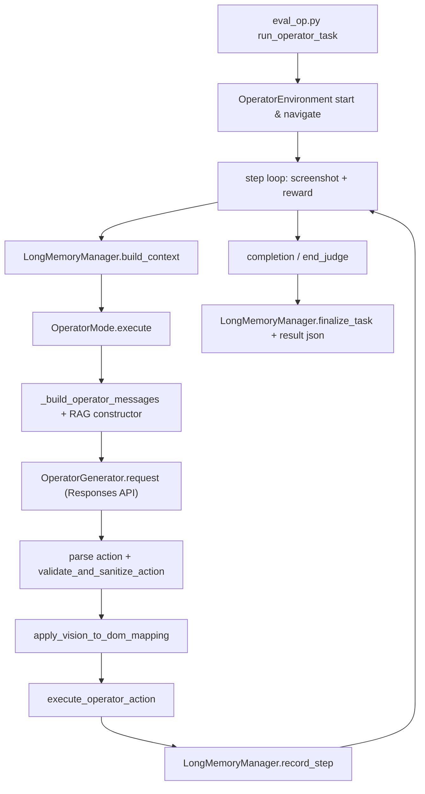

# WebRAGent 项目深度技术文档（超详细面试版）

本文档目标：

1. 给出项目全景和每个关键模块的实现思路。
2. 对“多模态 RAG、Vision-to-DOM、层次化记忆”做代码级拆解。
3. 覆盖运行链路、数据结构、核心算法、容错分支、配置项语义。
4. 作为面试备战手册，支持你回答“为什么这么做、怎么做、效果怎么验证”。

---

## 0. 结论先行（给面试官的 30 秒版本）

WebRAGent 是一个网页任务智能代理框架，主执行链路是：

- 环境层（Playwright 浏览器交互）
- 规划层（LLM + Prompt + RAG）
- 记忆层（短期轨迹 + 长期知识）
- 执行动作层（click/type/scroll 等）
- 评估层（reward + end judge + 结果落盘）

本次补齐后，简历中的三项核心能力都能在代码上找到可运行实现：

1. 多模态双路 RAG：`hybrid_rag`（视觉路由 + 文本路由融合）
2. 跨模态动作推理：Operator 执行前接入 Vision-to-DOM 映射
3. 层次化记忆：短期轨迹 + 长期记忆（参考轨迹 + 网站知识）完整闭环

---

## 1. 项目整体架构

## 1.1 目录与职责（核心）

- `eval_op.py`：Operator 单任务主执行入口（最关键主循环）。
- `batch_eval_op.py`：批量任务调度入口。
- `agent/Plan/planning.py`：模式选择（DOM/Operator）与规划执行。
- `agent/Prompt/prompt_constructor.py`：各种 prompt 构造与 RAG 实现。
- `agent/Environment/html_env/operator_env.py`：Operator 环境封装。
- `agent/Environment/html_env/operator_actions.py`：动作工厂与执行器。
- `agent/Memory/base_trace.py`：长期记忆总管理器。
- `agent/Memory/short_memory/history.py`：短期记忆串接。
- `agent/Memory/long_memory/reference_trace.py`：历史轨迹召回。
- `agent/Memory/long_memory/website_knowledge.py`：网站知识与失败模式库。
- `agent/Plan/vision_dom_mapper.py`：Vision-to-DOM 映射器（本次新增）。
- `agent/LLM/operator.py`：OpenAI Responses API 对接（computer-use-preview）。

## 1.2 执行链路（Operator）



---

## 2. 简历描述准确性判断（补齐前/后）

## 2.1 多模态 RAG 双路检索

补齐前：

- 有 `vision_rag`（图像向量检索）和 `description_rag`（文本检索）两条独立通路。
- 缺统一融合策略，无法在一个步骤里联合两类证据。

补齐后：

- 新增 `OperatorHybridRAGConstructor`，在一个 prompt 中融合视觉与文本两类参考。
- 在 `planning.py` 中支持 `rag_mode=hybrid_rag`，并记录融合信息（visual_task_id / text_task_id / fusion_confidence）。

## 2.2 Vision-to-DOM 映射

补齐前：

- `vision_to_dom` 相关 prompt 很弱，Operator 主链路仍是纯坐标执行。

补齐后：

- 新增 `VisionDOMMapper`，通过“坐标 + 文本锚点 + 交互语义”对 DOM 候选评分。
- 新增 `OperatorEnvironment.get_interactive_elements()` 抽取当前视口交互元素。
- 在 `eval_op.py` 动作执行前强制尝试映射，落 trace 记录映射信息。

## 2.3 层次化记忆

补齐前：

- `LongMemoryManager` 预留了接口，但 `website_knowledge.py` 为空文件，长期记忆半瘫痪。

补齐后：

- 完整实现 `WebsiteKnowledgeMemory`，支持：
  - 站点级任务统计
  - 动作成功率统计
  - 错误模式计数
  - 启发式策略提示
- 主循环中接入 `build_context`、`record_step`、`finalize_task`，形成闭环。

结论：简历三点“可落代码证明”成立；“显著提升完成率”需跑实验数据支撑。

---

## 3. 长期记忆系统（重点深挖）

## 3.1 为什么要长期记忆

网页任务常见问题：

1. 跨步骤遗忘：代理在第 N 步不知道第 1~N-1 步的稳定经验。
2. 跨任务经验失效：不同任务在同站点常有重复交互模式（登录、搜索、筛选）。
3. 错误重复：同类型失败被反复触发（权限、验证码、元素误击）。

长期记忆的作用：

- 不是“替代当前观察”，而是提供先验（prior）。
- 让代理在复杂站点上“少踩已知坑”，更快收敛到有效动作序列。

## 3.2 分层设计

层次化结构：

1. 短期记忆（task-local）
- 载体：`previous_trace`，每步 thought/action/reflection。
- 作用：当前任务内连续推理。

2. 长期记忆（cross-task）
- 参考轨迹层：`ReferenceTraceMemory`
- 网站知识层：`WebsiteKnowledgeMemory`

统一入口：`LongMemoryManager`。

## 3.3 LongMemoryManager 代码职责

文件：`agent/Memory/base_trace.py`

关键方法：

- `build_context(task_name, task_id, website, current_url)`
  - 拉取网站摘要 + 相似历史轨迹
  - 生成 `formatted_context`（可直接注入 prompt）
- `record_step(...)`
  - 单步写入轨迹与网站知识
- `finalize_task(...)`
  - 任务结束写入任务级结果统计

关键代码（节选）：

```python
knowledge_summary = self.website_memory.get_site_summary(website_key)
references = self.reference_memory.query_similar(
    task_name=task_name,
    website=website_key,
    current_url=current_url,
    top_k=self.max_reference_items,
    exclude_task_id=task_id,
)
```

## 3.4 参考轨迹层（ReferenceTraceMemory）

文件：`agent/Memory/long_memory/reference_trace.py`

存储：

- JSONL（`reference_traces.jsonl`）
- 一行一个 step 记录

召回打分公式（实现逻辑）：

- `task_sim`：任务词 Jaccard
- `website_score`：站点匹配分
- `url_sim`：URL token Jaccard
- `success_bonus`：成功奖励/失败惩罚
- `reward_bonus`：reward 分数归一化增益
- `recency_bonus`：最近时间加权

代码中组合：

```python
final_score = (
    0.45 * task_sim
    + 0.25 * website_score
    + 0.15 * url_sim
    + success_bonus
    + reward_bonus
    + recency_bonus
)
```

解释：

- 任务语义最高权重（0.45）
- 站点一致性第二（0.25）
- URL 局部路径第三（0.15）
- 成败/奖励/新近性是微调项

## 3.5 网站知识层（WebsiteKnowledgeMemory）

文件：`agent/Memory/long_memory/website_knowledge.py`

存储文件：`website_knowledge.json`

每个站点结构：

- `task_stats`：任务统计
- `action_stats`：动作统计（total/success/failure）
- `error_patterns`：错误模式计数
- `recent_steps`：最近步骤序列
- `recent_tasks`：最近任务摘要

### 3.5.1 update_with_step

每步写入：

- 动作计数、成功失败计数
- recent_errors 滚动窗口
- error_patterns 计数并截断 top-N
- recent_steps 限长保留

### 3.5.2 record_task_outcome

任务收尾写入：

- `total_tasks/completed_tasks/total_steps/total_reward`
- 最近任务信息（task_id, final_status, total_steps）

### 3.5.3 get_site_summary

生成可注入 LLM 的站点摘要：

- completion_rate、avg_steps、avg_reward
- 高频动作成功率
- 常见失败模式
- 启发式策略建议

策略建议规则（实现）包括：

- 失败比率高：提示保守动作
- 动作高重复：提示避免盲目重复
- 登录/验证码类错误：提示先识别认证状态

## 3.6 长期记忆在执行链中的接入点

文件：`eval_op.py`

1. 初始化：

```python
long_memory_manager = LongMemoryManager(
    enabled=long_memory_enabled,
    memory_dir=long_memory_dir,
    max_reference_items=long_memory_top_k,
)
```

2. 每步规划前：

```python
memory_context_payload = long_memory_manager.build_context(...)
long_memory_context = memory_context_payload.get("formatted_context", "")
```

3. 每步动作后：

```python
long_memory_manager.record_step(...)
```

4. 任务结束：

```python
long_memory_manager.finalize_task(...)
```

## 3.7 长期记忆如何影响决策

不是直接“替换 action”，而是通过 prompt context 影响规划模型。

在 `planning.py` 中通过 `_inject_long_memory_context(...)` 注入：

```python
context_block = (
    "\n## Hierarchical Long-Term Memory ##\n"
    f"{context}\n"
    "Use it as a prior, but ground final action on current screenshot and page state."
)
```

这句话很关键，明确限制 LLM 不能脱离当前页面做“历史幻觉决策”。

---

## 4. 多模态 RAG 系统（重点深挖）

## 4.1 RAG 模式矩阵

当前支持：

- `description`
- `vision`
- `vision_rag`
- `description_rag`
- `hybrid_rag`（本次新增）
- `none`

## 4.2 各模式核心区别

1. `vision` / `description`
- 以已有离线示例格式检索并拼接到 prompt。

2. `vision_rag`
- 使用 embedding 数据库检索（图片+任务）
- 可选 GPT-4 re-rank

3. `description_rag`
- embedding 检索候选任务，再按任务 ID 拉取描述轨迹

4. `hybrid_rag`
- 同时跑视觉路由和文本路由，再融合提示

## 4.3 `OperatorMode._build_operator_messages` 如何选择构造器

文件：`agent/Plan/planning.py`

核心分支：

```python
if rag_mode == "vision":
    OperatorPromptVisionRetrievalConstructor()
elif rag_mode == "vision_rag":
    OperatorVisionRAGConstructor()
elif rag_mode == "description_rag":
    OperatorDescRAGConstructor()
elif rag_mode == "hybrid_rag":
    OperatorHybridRAGConstructor()
else:
    OperatorPromptDescriptionRetrievalConstructor()
```

## 4.4 `OperatorHybridRAGConstructor` 设计

文件：`agent/Prompt/prompt_constructor.py`

设计目标：

- 视觉路由给“界面态相似性”
- 文本路由给“任务语义相似性”
- 两路融合后再交由 LLM 做最终动作决策

构造流程：

1. 调 `OperatorVisionRAGConstructor.construct(...)` 得视觉参考消息
2. 调 `OperatorDescRAGConstructor.construct(...)` 得文本参考
3. 把文本参考追加到视觉消息中
4. 追加融合指导（冲突时优先当前页面）
5. 计算融合置信信息（`fusion_confidence`）用于日志与分析

关键代码（节选）：

```python
self.last_retrieved_info = {
    "visual_task_id": visual_task_id,
    "text_task_id": text_task_id,
    "fusion_confidence": fusion_confidence,
    "vision_info": vision_info,
    "text_info": desc_info,
}
```

## 4.5 RAG 缓存与容错

- 构造器缓存：`self.rag_constructors`
- 模式切换复用，减少重复初始化
- 构造失败回退：自动降级到非 RAG 简单消息构造

回退代码（节选）：

```python
except Exception as construct_error:
    return self._build_operator_messages(..., rag_enabled=False, ...)
```

## 4.6 批任务预构建策略

文件：`batch_eval_op.py`

现在对 embedding 型模式统一预构建索引：

```python
if args.rag_mode in ["vision_rag", "description_rag", "hybrid_rag"]:
    rag_cache_dir = prebuild_rag_database(args)
```

避免每个任务重复建库，显著降低批量评测冷启动成本。

---

## 5. Vision-to-DOM 映射系统（重点深挖）

## 5.1 为什么需要映射

纯视觉坐标的问题：

- 页面滚动/布局变化导致坐标漂移
- 动态组件重绘后同坐标不再对应同元素
- LLM 思考与真实可交互元素可能错位

映射的目标：

- 把“点坐标”提升为“点元素”
- 执行动作前做一次稳定锚定

## 5.2 DOM 候选采集

文件：`agent/Environment/html_env/operator_env.py`

新增方法：`get_interactive_elements(max_elements=300)`

采集策略：

- CSS selector 抽取：`a[href],button,input,textarea,select,[role=button]...`
- 可见性过滤：尺寸、视口范围、display/visibility
- 去重：按矩形+标签+id 去重
- 输出字段：`tag/role/text/aria_label/name/placeholder/dom_id/rect`

这一步是映射质量上限的关键数据基础。

## 5.3 映射评分函数

文件：`agent/Plan/vision_dom_mapper.py`

输入：

- 原动作（坐标）
- DOM 候选列表
- 思考文本 thought
- 任务文本 task_name

评分组成：

1. 几何分（主要）
- 点在框内：按中心距离衰减
- 点在框外：指数衰减

2. 文本分
- `thought + task + action_input` 与元素文本锚点 Jaccard

3. 语义先验
- `role/tag` 是按钮/链接/输入时给 bonus

最终分：

```python
score = 0.68 * coord_score + 0.22 * text_score + clickable_bonus + visibility_bonus
```

置信阈值：`min_confidence=0.35`。

## 5.4 映射后动作重写

映射成功时重写字段：

- `coordinates` -> 元素中心
- `action_input` -> `x,y`
- `element_id` -> dom_id/name/aria_label/text（兜底）
- 增加 `dom_target` 与 `mapping_confidence`

## 5.5 执行链中位置

文件：`eval_op.py`

- `validate_and_sanitize_action` 之后
- `execute_operator_action` 之前

```python
mapped_action, mapping_info = await apply_vision_to_dom_mapping(...)
validated_action = mapped_action
success = await execute_operator_action(env, validated_action)
```

并把映射元数据写入 trace：

```python
task_trace[-1]["vision_to_dom_mapping"] = mapping_info
```

## 5.6 当前覆盖边界

已覆盖：

- `operator_click`
- `operator_double_click`

未覆盖（可迭代）：

- `operator_type`（输入框自动聚焦映射）
- `operator_scroll`（区域滚动目标映射）
- 多候选 disambiguation（同文案按钮）

---

## 6. Operator 主循环实现细节（逐阶段）

文件：`eval_op.py::run_operator_task`

## 6.1 初始化阶段

- 启动环境、网络健康检查、导航。
- 创建 LLM 实例与 `OperatorMode`。
- 初始化：completion manager、end judge、long memory manager、vision_dom_mapper。

## 6.2 每步处理流程

1. 截图与进度记录
2. 可选 reward 评估（基于 previous_trace）
3. 构建长期记忆上下文
4. 调 `operator_mode.execute(...)` 获取 thought/action
5. 循环检测与干预（confirmation loop / info task completion）
6. action validate
7. Vision-to-DOM 映射
8. 执行动作
9. 写短期轨迹与长期记忆
10. completion/end_judge 检查

## 6.3 动作执行函数

文件：`eval_op.py::execute_operator_action`

- 对不同动作设置不同等待策略：
  - click/double_click：短稳定等待
  - type：短等待
  - scroll：限幅后执行
  - keypress：Enter/Tab 等触发更严格等待
- 未知动作有降级策略（click/scroll/最小 wait）
- 执行后对比页面状态变化，必要时等待页面就绪

## 6.4 动作校验函数

文件：`eval_op.py::validate_and_sanitize_action`

- 白名单动作类型校验
- 坐标越界修复（限制到 1280x720 范围）
- 滚动幅度限幅
- 输入文本长度截断
- wait 时长限幅

这一步减少 LLM 输出噪声造成的不可执行动作。

---

## 7. 规划层与响应解析细节

## 7.1 OperatorMode.execute

文件：`agent/Plan/planning.py`

职责：

1. 组装消息（含 RAG / 长期记忆）
2. 调用 `OperatorGenerator.request`
3. 解析响应 JSON（actions/text/reasoning）
4. 转换为内部动作格式（`operator_click` 等）
5. 记录 token、日志、错误上下文

## 7.2 Operator 响应格式转换

核心转换函数：`_convert_operator_action`

例：

- API `click` -> 内部 `operator_click`
- API `scroll` -> 内部 `operator_scroll`
- API `final_answer` -> `get_final_answer`

## 7.3 错误分支设计

- API error：返回 wait 兜底动作
- JSON parse error：记录 parse_error，并返回 wait
- 执行期异常：记录 execute_error，并返回 wait

目标是尽量“不中断任务主循环”，而不是一次异常即崩。

---

## 8. LLM 接入层细节（Responses API）

文件：`agent/LLM/operator.py`

## 8.1 会话连续性

维护字段：

- `previous_response_id`
- `last_call_id`

首轮使用完整 system+user+screenshot；
后续轮次优先用 `computer_call_output` 继续状态。

## 8.2 格式转换

- 将内部 messages 转为 Responses API 所需结构
- 自动拼接 screenshot（base64）

## 8.3 响应提取

- 从 `ResponseComputerToolCall` 抽动作
- 从 `ResponseOutputMessage` 抽文本
- 输出统一 JSON 字符串供规划层解析

---

## 9. Reward 与停止策略

## 9.1 GlobalReward

文件：`agent/Reward/global_reward.py`

- 以 previous_trace + 当前观测构建奖励请求
- 输出 `score + description`
- 作为状态描述输入下一步规划

## 9.2 CompletionManager / EndJudge

主循环中的停止来源：

1. 达到最大步数
2. reward 判定
3. 明确 `get_final_answer`
4. EndJudge 判断完成或关键错误
5. 连续错误阈值触发

---

## 10. 配置与参数语义（补充后）

## 10.1 `configs/setting.toml`

新增：

```toml
[memory]
enabled = true
memory_dir = "memory_store"
top_k = 3
```

## 10.2 CLI 参数（eval_op）

- `--rag_mode`: 支持 `hybrid_rag`
- `--long_memory_enabled`: `auto|true|false`
- `--long_memory_dir`
- `--long_memory_top_k`

`auto` 语义：优先读取 TOML `[memory]`。

## 10.3 CLI 参数（batch_eval_op）

同样透传 long memory 参数；
embedding 型 RAG 模式会自动预构建索引缓存。

---

## 11. 数据落盘与可观测性

## 11.1 长期记忆落盘

- `memory_store/reference_traces.jsonl`
- `memory_store/website_knowledge.json`

## 11.2 任务结果落盘

`eval_op.py` 输出结果 JSON，包含：

- trace（每步 thought/action/reward）
- final_state
- completion metadata
- long_memory 开关与目录信息

## 11.3 RAG/Prompt 日志

可通过参数启用，支持问题排查：

- 本步召回了什么
- prompt 拼接了什么
- token 消耗如何

---

## 12. 关键代码片段（可直接讲给面试官）

## 12.1 长期记忆上下文构建

```python
memory_context_payload = long_memory_manager.build_context(
    task_name=task_name,
    task_id=task_uuid,
    website=website,
    current_url=current_url_for_memory,
)
long_memory_context = memory_context_payload.get("formatted_context", "")
```

## 12.2 长期记忆注入 Planner

```python
planning_response, ..., rag_data = await operator_mode.execute(
    ...,
    long_memory_context=long_memory_context,
)
```

## 12.3 Planner 注入消息

```python
content.append({"type": "input_text", "text": context_block})
```

## 12.4 Vision-to-DOM 映射调用

```python
mapped_action, mapping_info = await apply_vision_to_dom_mapping(
    env=env,
    mapper=vision_dom_mapper,
    action_dict=validated_action,
    thought=planning_response_thought or "",
    task_name=task_name,
)
```

## 12.5 映射评分

```python
0.68 * coord_score + 0.22 * text_score + clickable_bonus + visibility_bonus
```

## 12.6 hybrid_rag 构造器选择

```python
elif rag_mode == "hybrid_rag":
    OperatorHybridRAGConstructor()
```

---

## 13. 面试问答库（深入版）

### Q1：长期记忆到底在做什么？

答法：

- 不是简单存日志，而是形成两层可检索知识：
  - 轨迹层：按任务/URL/站点/成功率/时间召回相似 step
  - 网站层：统计站点动作成功率与错误模式
- 在每一步规划前注入摘要，让模型借鉴稳定策略，减少重复错误。

### Q2：为什么不只做 RAG，不做长期记忆？

答法：

- RAG 主要来自离线样本库；长期记忆来自在线真实执行反馈。
- RAG 解决“先验经验迁移”；长期记忆解决“运行时自适应学习”。
- 两者互补：离线知识 + 在线经验。

### Q3：Vision-to-DOM 为什么能提升稳定性？

答法：

- 坐标是连续空间，元素是离散语义锚点。
- 先找到最可能的元素，再把点击吸附到元素中心，抗抖动能力更强。
- 结合 thought/task 文本对齐，可避免“近但错”的点击。

### Q4：hybrid_rag 的融合策略是什么？

答法：

- 视觉路由优先描述页面相似度，文本路由优先描述任务语义相似度。
- 统一写进 prompt，并显式指导冲突处理：优先当前页面证据。
- 同时记录融合信息，便于后续评估和 ablation。

### Q5：如何做 ablation 证明每个模块有效？

答法：

按三维做对照：

1. RAG 维度：none / vision_rag / description_rag / hybrid_rag
2. 映射维度：Vision-to-DOM on/off
3. 记忆维度：long-memory on/off

指标：

- 完成率
- 平均步数
- 无效动作率
- 重复动作率
- 异常恢复率

---

## 14. 风险、边界与改进方向

## 14.1 已知边界

1. `hybrid_rag` 目前是串行融合，推理时延较高。
2. Vision-to-DOM 仅覆盖 click/double_click。
3. 网站知识层策略建议是启发式规则，不是可学习策略网络。
4. 记忆存储目前无压缩与衰减机制，长期运行后需治理。

## 14.2 可落地改进

1. 引入可学习融合器（cross-encoder）替代规则融合。
2. 扩展映射到 type/select/scroll region。
3. 长期记忆加入时间衰减和站点版本识别。
4. 加入 memory eviction 策略和统计可视化面板。

---

## 15. 本次改动文件与作用对照

1. `agent/Memory/long_memory/website_knowledge.py`
- 从空文件变为可持久化网站知识库（任务/动作/错误/策略摘要）。

2. `agent/Plan/vision_dom_mapper.py`
- 新增 Vision-to-DOM 映射器（评分与重定位）。

3. `agent/Environment/html_env/operator_env.py`
- 新增 `get_interactive_elements()`，给映射器提供 DOM 候选。

4. `agent/Plan/planning.py`
- 支持 `hybrid_rag`。
- 支持 `long_memory_context` 注入。
- 完善 RAG 回退逻辑。

5. `agent/Prompt/prompt_constructor.py`
- 新增 `OperatorHybridRAGConstructor`。
- 修复部分构造器 `_cache_saved` 初始化。

6. `eval_op.py`
- 主循环接入长期记忆读写。
- 主循环接入 Vision-to-DOM 映射。
- 增加 long memory CLI 参数。

7. `batch_eval_op.py`
- 扩展 `hybrid_rag` 与 long memory 参数透传。
- embedding 模式统一预构建索引。

8. `configs/setting.toml`
- 新增 `[memory]` 段。

---

## 16. 快速复述模板（1 分钟）

如果面试官问“你这个项目具体做了什么？”

可以这样答：

“我做的是一个网页任务智能代理，核心是把规划、执行、记忆和检索串成闭环。执行上我们支持 Operator 视觉坐标动作；为了解决纯坐标不稳定，我实现了 Vision-to-DOM 映射，把动作在执行前吸附到真实 DOM 交互元素。知识上我们做了双层记忆：短期是当前任务轨迹，长期是跨任务的参考轨迹和网站知识库；每步都会读长期记忆做先验、写回执行结果形成在线学习。检索上我补了 hybrid_rag，把视觉检索和文本检索融合成同一步上下文，降低单路召回偏差。最后通过 reward、end judge 和容错回退保证任务不会轻易崩掉。”

---

## 17. 附：最常用运行命令

单任务（建议）：

```bash
python eval_op.py \
  --observation_mode operator \
  --rag_mode hybrid_rag \
  --long_memory_enabled auto \
  --long_memory_dir memory_store \
  --long_memory_top_k 3
```

批任务：

```bash
python batch_eval_op.py \
  --rag_mode hybrid_rag \
  --long_memory_enabled auto \
  --long_memory_dir memory_store \
  --long_memory_top_k 3
```


---

## 18. 函数级技术细节（逐方法拆解）

本节按“输入 -> 处理 -> 输出 -> 失败分支”格式展开，供面试时深问回答。

## 18.1 `LongMemoryManager.build_context`

函数签名：

```python
build_context(task_name, task_id="", website="", current_url="") -> Dict[str, Any]
```

输入：

- `task_name`: 当前任务语义
- `task_id`: 当前任务 ID（用于排除同任务历史）
- `website/current_url`: 站点定位信息

处理：

1. 先计算 `website_key`。
2. 取 `WebsiteKnowledgeMemory.get_site_summary(website_key)`。
3. 取 `ReferenceTraceMemory.query_similar(...)`。
4. 拼接 `formatted_context`。

输出：

- `knowledge_summary`: 网站级摘要文本
- `reference_traces`: 相似轨迹列表
- `formatted_context`: 注入 LLM 的最终上下文

失败分支：

- 若记忆关闭或未初始化，返回 `enabled=False` 空上下文。

## 18.2 `ReferenceTraceMemory.query_similar`

函数签名：

```python
query_similar(task_name, website="", current_url="", top_k=3, exclude_task_id="")
```

输入处理细节：

- 对 task/url 做 token 化。
- 遍历本地缓存 `_records` 逐条打分。

打分构成（可直接背）：

- `0.45 * task_sim`
- `0.25 * website_score`
- `0.15 * url_sim`
- `success_bonus`
- `reward_bonus`
- `recency_bonus`

输出：

- 按 score 排序后 top-k 记录
- 每条 record 额外带 `score`

失败分支：

- 空库返回 `[]`
- 低于阈值（<=0）候选被丢弃

时间复杂度：

- 线性扫描 O(N)，N 是本地轨迹条数。

## 18.3 `WebsiteKnowledgeMemory.update_with_step`

函数签名：

```python
update_with_step(website, task_name, current_url, action, success, error="", reflection="", reward_status="", status="")
```

处理细节：

1. 标准化站点 key。
2. `action_stats[action_key]` 更新 total/success/failure。
3. 失败时更新 `recent_errors` 与 `error_patterns` 计数。
4. 追加 `recent_steps`，并执行窗口裁剪。
5. 立即落盘 JSON。

为什么每步落盘：

- 进程崩溃时尽量减少记忆丢失。
- 支持长任务中途恢复分析。

## 18.4 `WebsiteKnowledgeMemory.get_site_summary`

函数签名：

```python
get_site_summary(website) -> str
```

生成内容：

1. 基础统计：任务量、完成率、平均步数、平均奖励。
2. 高频动作及动作成功率。
3. 常见失败模式（top3）。
4. 启发式策略建议（高失败率、高重复、认证失败）。

设计取舍：

- 输出是短文本摘要，而不是原始 JSON：
  - 好处：减少 token，便于 LLM吸收
  - 风险：信息压缩可能丢细节

## 18.5 `VisionDOMMapper.map_action`

函数签名：

```python
map_action(action, dom_elements, thought="", task_name="") -> (mapped_action, mapping_info)
```

输入约束：

- 仅处理 `operator_click/operator_double_click`。
- `coordinates` 必须是 `[x, y]`。

处理细节：

1. 构建 query tokens：`thought + task_name + action_input`。
2. 遍历 DOM 候选，计算 `_score_element`。
3. 取最高分候选。
4. 若低于 `min_confidence` 则不映射。
5. 映射成功时重写 action 并补 `dom_target`。

输出字段：

- `mapped_action.mapping_confidence`
- `mapping_info.best_score/target_tag/target_text/...`

## 18.6 `OperatorEnvironment.get_interactive_elements`

函数签名：

```python
get_interactive_elements(max_elements=300) -> List[Dict]
```

浏览器侧 JS 逻辑：

1. querySelectorAll 一组交互选择器。
2. 过滤不可见元素。
3. 过滤视口外元素。
4. 构建简化元数据（bbox + 文本 + 语义属性）。
5. 去重并截断数量。

输出结构示例：

```json
{
  "tag": "button",
  "role": "button",
  "text": "Search",
  "aria_label": "Search",
  "name": "q",
  "dom_id": "search-btn",
  "rect": {
    "x": 90,
    "y": 120,
    "width": 84,
    "height": 30,
    "center_x": 132,
    "center_y": 135
  }
}
```

## 18.7 `OperatorMode._build_operator_messages`

关键职责：

1. 根据 `rag_mode` 选择构造器。
2. previous_trace 字符串转 list[dict]。
3. 调构造器拿 messages。
4. 记录结构化 rag_data。
5. 注入 long memory context。
6. 失败时降级到 non-rag 消息。

关键失败分支：

- import 构造器失败 -> 回退 non-rag
- construct 失败 -> 回退 non-rag

设计收益：

- RAG 组件不稳定时，主任务链路仍可运行。

## 18.8 `OperatorMode.execute`

核心 I/O：

- 输入：`status_description/user_request/previous_trace/feedback/screenshot/...`
- 输出：`(planning_response, error_message, thought, action, token_count, rag_data)`

内部阶段：

1. 构消息
2. 调 `OperatorGenerator.request`
3. 解析 JSON
4. 生成 thought（多字段兜底）
5. 转 action（`_convert_operator_action`）
6. prompt log / rag log

失败分支：

- API 失败：返回 wait action
- parse 失败：返回 wait action + parse_error
- execute 失败：返回 wait action + execute_error

## 18.9 `OperatorGenerator._format_messages_for_responses_api`

行为差异：

- 首轮：system+user+image（标准输入）
- 续轮：`computer_call_output` + screenshot（增量续对话）

为什么要这么做：

- 与 Responses API computer-use 协议对齐。
- 保持工具调用上下文连贯。

## 18.10 `validate_and_sanitize_action`

价值：

- 在执行前做“最后一道 deterministic 安全闸门”。
- 减少 LLM 偶发格式漂移造成的灾难性动作。

保护点：

- 动作白名单
- 坐标边界
- 滚动限幅
- 文本长度限制
- wait 时长限制

## 18.11 `apply_vision_to_dom_mapping`

职责：

- 把映射器与环境解耦。
- 统一做 dom 抽取错误处理与 mapping_info 补充。

返回约定：

- 始终返回 `(action_dict, mapping_info)`，避免中断主流程。

## 18.12 `execute_operator_action`

阶段：

1. 记录执行前页面状态
2. 按动作类型执行
3. 按类型等待（自适应）
4. 对比页面状态变化
5. 视情况等待页面就绪

这里体现“执行层工程化”：不是盲 execute，而是兼顾页面异步行为。

---

## 19. 核心数据结构与 Schema

## 19.1 `task_trace`（结果文件中的每步）

典型字段：

- `step`
- `thought`
- `action`（原规划动作）
- `validated_action`（校验后动作）
- `vision_to_dom_mapping`
- `reward`
- `reward_tokens`
- `end_judge_result`（若存在）

## 19.2 `rag_data`（规划期日志对象）

常见字段：

- `rag_enabled/rag_mode/rag_method`
- `rag_constructor_type`
- `retrieved_info`
- `constructed_messages`
- `planning_response`
- `token_counts`
- `error/parse_error/execute_error`

## 19.3 `website_knowledge.json`（长期网站知识）

顶层：

- `sites: {site_key: site_record}`

`site_record`：

- `task_stats`
- `action_stats`
- `error_patterns`
- `recent_steps`
- `recent_tasks`

## 19.4 `reference_traces.jsonl`（长期轨迹）

每行记录字段：

- `task_id/task_name/website/current_url`
- `step_idx`
- `thought/action/reflection`
- `success/error`
- `reward_score/reward_status`
- `timestamp`

## 19.5 `mapping_info`（映射诊断）

成功时：

- `mapped=True`
- `best_score`
- `target_tag/target_text/target_role/target_rect`
- `dom_candidates`

失败时：

- `mapped=False`
- `reason`（low_confidence / empty_dom_candidates / ...）

---

## 20. 算法与工程 trade-off

## 20.1 为什么轨迹检索用规则打分而不是向量库

当前实现是轻量规则打分，优点：

- 可解释性强
- 不依赖额外服务
- 读取简单

缺点：

- 大规模数据时 O(N) 扫描慢
- 语义能力弱于 dense retrieval

可升级方向：

- 轨迹 embedding + ANN 索引
- 规则打分做后重排

## 20.2 为什么网站知识是摘要文本注入

优点：

- token 成本可控
- 与 prompt 机制天然兼容

缺点：

- 复杂统计被压缩后可能信息损失

可升级方向：

- 结构化 memory tool 调用
- 按需检索细粒度 memory slot

## 20.3 Vision-to-DOM 打分权重可调性

当前权重偏重几何（0.68），原因：

- 点击动作本质是空间定位问题
- 文本锚点在图文复杂页面可能噪声较大

可升级方向：

- 按站点动态调权
- 在线学习权重（bandit）

---

## 21. 调试与排障手册

## 21.1 典型问题：RAG 构造器异常

现象：日志出现 `RAG message construction failed`。

排查顺序：

1. `rag_mode` 是否拼写正确
2. `rag_cache_dir` 索引文件是否存在
3. embedding 依赖是否完整
4. 相关 JSON/parquet 数据路径是否存在

处理：

- 代码会自动回退 non-rag，任务可继续跑。

## 21.2 典型问题：动作频繁失败

看三处日志：

1. `validated_action`
2. `vision_to_dom_mapping`
3. `feedback`

常见原因：

- 坐标越界被修正到中心但仍不对
- DOM 候选为空（弹窗遮挡/iframe）
- thought 与页面语义偏差太大导致映射低分

## 21.3 典型问题：长期记忆“看起来没效果”

检查：

1. 是否开启 `long_memory_enabled`
2. `memory_store` 是否写入两类文件
3. `formatted_context` 是否实际注入
4. 任务是否有可复用历史（冷启动时本来就弱）

## 21.4 典型问题：Responses API 会话丢失

现象：`No call_id available ... resetting to fresh conversation`。

解释：

- 上一轮没有 computer tool call，续轮上下文无法直接延续。
- 代码会 reset 到首轮格式，保证不中断。

---

## 22. 面试官追问：你是怎么验证“实现正确”的？

你可以回答两层验证：

1. 静态层
- 语法编译检查
- 关键分支检查（RAG 模式切换、回退链路）

2. 动态层
- 最小可运行验证：
  - `WebsiteKnowledgeMemory` 读写摘要
  - `VisionDOMMapper` 对候选元素映射
- 端到端验证（建议你后续做）
  - 单任务 smoke test
  - 批任务 ablation

建议你在项目里补一份 `scripts/ablation_eval.sh`，把实验流水线固定下来。

---

## 23. 简历写法建议（基于当前代码真实度）

你可以这样写（更稳）：

- “设计并实现多模态双路 RAG（视觉检索+文本检索）及融合策略，在复杂网页任务中提升检索鲁棒性。”
- “实现 Vision-to-DOM 映射机制，将视觉坐标动作对齐到 DOM 可交互元素，降低页面抖动导致的点击失效率。”
- “构建层次化记忆架构（短期轨迹+长期网站知识/参考轨迹），并打通在线读写闭环以提升跨步骤一致性。”
- “通过批量 ablation（RAG/映射/记忆开关）评估任务完成率、平均步数和无效动作率。”

注意：

- “显著提升 xx%”请等你跑出数字再填。

---

## 24. 你接下来最应该做的三件事

1. 跑一轮标准 ablation，产出可引用数字（完成率、步数、失败率）。
2. 把 `Vision-to-DOM` 扩展到 `operator_type`（输入框定位）和 `select`。
3. 给长期记忆加衰减和清理策略，避免长期污染。

